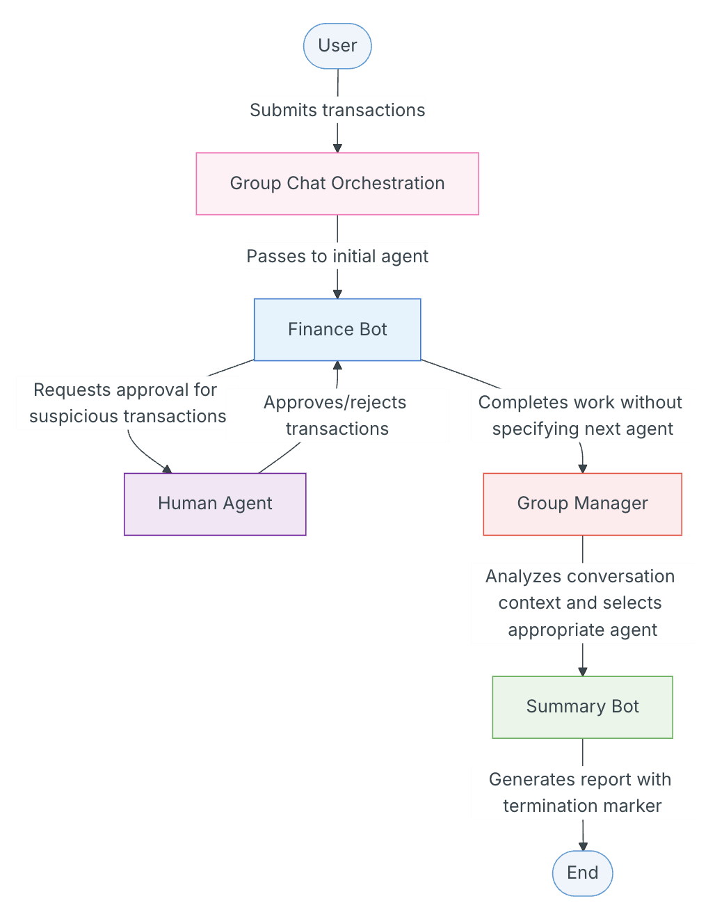

# 🤖 Multi-Agent Orchestration Using AG2 (AutoGen 2.0)

This repo explores **human-in-the-loop pattern** and **multi-agent orchestration** using [AG2 (AutoGen 2.0)](https://github.com/ag2ai/ag2).  

It demonstrates how **agents, workflows, and human oversight** can be combined to build **controllable, reliable, and enterprise-ready AI solutions**.

## 🔹 Patterns Implemented
- **Human Approval Loops** — inject human feedback into AI workflows before critical actions.
- **Multi-Agent Orchestration** — leverage AG2’s **AutoPattern** framework for complex workflows.

---

#### 🤝 [hitl.py](hitl.py)
This is a working example of **Human in the Loop (HITL)** pattern that enables your AG2 agents to collaborate with humans during their workflow. Instead of making all decisions independently, agents can check with human operators at critical decision points, combining AI efficiency with human judgment. The example demonstrates a human-in-the-loop agent that processes financial transactions and flags suspicious ones for human approval.

---

#### [orchestration.py](orchestration.py)
This is a working example of **agent orchestration** which allows us to coordinate multiple specialized agents to work together seamlessly. The example specifically demonstrates an **AutoPattern** orchestration pattern, where a group manager agent automatically selects agents to speak by evaluating the messages in the chat and the descriptions of the agents. This creates a natural workflow where the most appropriate agent responds based on the conversation context.

---

### Multi-Agent Orchestration Workflow

---

## 🚀 Quickstart

Follow these steps to set up and run the demos locally.

1. Clone the Repo

git clone https://github.com/baljindersingh/multi-agent-ag2.git
cd multi-agent-ag2

2. Create Virtual Environment

python -m venv .venv
source .venv/bin/activate   # Mac/Linux
.venv\Scripts\activate      # Windows

3. Install Dependencies

pip install -r requirements.txt

4. Pull the Phi-3 model from Ollama (LLM backend)

ollama pull phi3
ollama serve
